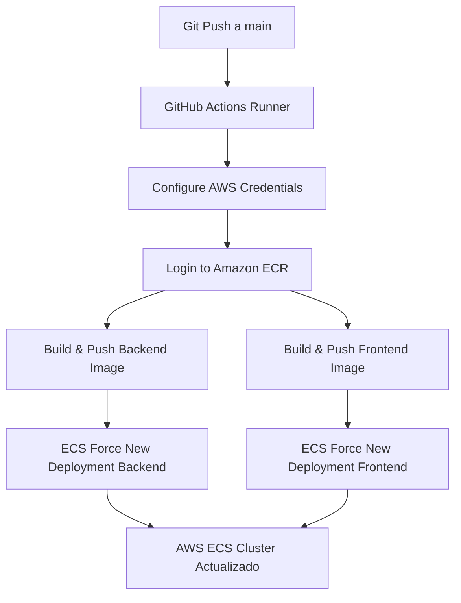

# INFORME TÉCNICO: ORQUESTACIÓN Y AUTOMATIZACIÓN EN LA NUBE
## Evaluación Parcial N° 3 - Introducción a Herramientas DevOps (ISY1101)

---

### Portada Informativa

*   **Institución:** Duoc UC
*   **Asignatura:** Introducción a Herramientas DevOps (ISY1101)
*   **Proyecto:** Tienda de Perritos - Solución de Orquestación y Automatización
*   **Caso de Estudio:** Innovatech Chile
*   **Integrantes (Dupla):** [Nombres de los Integrantes]
*   **Docente:** [Nombre del Docente]
*   **Fecha de Entrega:** 26 de Junio de 2026
*   **Estado del Proyecto:** 100% Desplegado y Operativo en Producción (AWS ECS)

---

## 1. Introducción y Contexto

El presente informe detalla la solución técnica diseñada para la empresa **Innovatech Chile**, cuyo objetivo era transicionar desde una aplicación básica contenedorizada hacia un **entorno productivo orquestado, tolerante a fallos, altamente disponible y completamente automatizado** en la nube de Amazon Web Services (AWS) a través de un pipeline de Integración y Despliegue Continuo (CI/CD).

La solución implementada consiste en una **Tienda de Perritos** compuesta por:
1.  Un **Frontend** web interactivo construido en HTML/CSS/JS y servido mediante un servidor web **Nginx**.
2.  Un **Backend** API REST construido sobre **Node.js y Express** que administra el catálogo de productos y simula transacciones financieras.

---

## 2. Arquitectura de Orquestación y Red en AWS

Se optó por utilizar **AWS ECS (Elastic Container Service) bajo el modelo Fargate (Serverless)** debido a las siguientes justificaciones técnicas:
*   **Bajo costo operativo y cero administración de servidores:** Fargate elimina la necesidad de aprovisionar y escalar manualmente instancias EC2, cobrando estrictamente por los recursos de CPU y memoria consumidos por tarea.
*   **Seguridad por diseño:** Cada tarea corre en su propio entorno de aislamiento a nivel de kernel.

### Diseño de Red e Infraestructura de Seguridad:
*   **VPC y Direccionamiento:** Se utilizó la infraestructura de red asignada en la VPC del laboratorio, garantizando subredes públicas para recibir el tráfico de internet y salida directa a la red para descargar las imágenes.
*   **Application Load Balancer (ALB):** Se configuró un ALB público como único punto de entrada para los usuarios finales en el puerto `80`.
*   **Enrutamiento Inteligente por Rutas (Path-Based Routing):** 
    Debido a que los entornos de **AWS Academy** tienen bloqueada la creación de Namespaces de *AWS Cloud Map* (impidiendo el uso de *ECS Service Connect* o *Private DNS*), se diseñó una arquitectura de enrutamiento en la capa 7 (HTTP) mediante el ALB:
    *   **Tráfico General (`/*`):** Es enviado al Target Group del Frontend (`tg-frontend`) en el puerto `80`.
    *   **Tráfico API (`/api/*`):** Es enviado directamente al Target Group del Backend (`tg-backend`) en el puerto `3000`.
*   **Security Groups:**
    *   `ALB-SG`: Permite entrada desde cualquier IP (`0.0.0.0/0`) en el puerto `80`.
    *   `Frontend-SG`: Permite tráfico únicamente desde el balanceador de carga en el puerto `80`.
    *   `Backend-SG`: Permite tráfico en el puerto `3000` restringido a los rangos de la red interna de la VPC, protegiendo la base de datos simulada y la API de accesos externos directos.

---

## 3. Detalle de la Contenedorización (Docker)

Ambos servicios fueron dockerizados de forma independiente utilizando imágenes optimizadas basadas en **Alpine Linux** para minimizar el tamaño de las imágenes en ECR y acelerar los tiempos de despliegue en ECS.

*   **Dockerfile del Backend:** Utiliza la imagen base oficial `node:18-alpine`, instala únicamente dependencias de producción (`express`, `cors`, `morgan`) y expone el puerto `3000`.
*   **Dockerfile del Frontend:** Utiliza `nginx:alpine`. Se destaca la configuración personalizada de [nginx.conf](file:///Users/crispadilla/Downloads/tiendaperritos/frontend/nginx.conf) la cual utiliza una **declaración de variable y un resolver DNS dinámico** para evitar que el contenedor Nginx se caiga al arrancar en entornos de nube cuando el host de backend no es directamente localizable.

---

## 4. Automatización del Pipeline CI/CD (GitHub Actions)

El flujo de integración y despliegue continuo se configuró en el workflow [.github/workflows/deploy.yml](file:///Users/crispadilla/Downloads/tiendaperritos/.github/workflows/deploy.yml) y opera de la siguiente manera ante cada `git push` a la rama `main`:

### Seguridad en el Pipeline:
*   Se usaron **GitHub Secrets** para enmascarar credenciales sensibles: `AWS_ACCESS_KEY_ID`, `AWS_SECRET_ACCESS_KEY` y `AWS_SESSION_TOKEN`.
*   El workflow está configurado específicamente para dar soporte al **token de sesión temporal (`AWS_SESSION_TOKEN`)** obligatorio dentro de la plataforma educativa AWS Academy.

---

## 5. Estrategia de Escalabilidad y Autoscaling

Para garantizar la alta disponibilidad y cumplir con el indicador **IE3**, se configuró una política de **Service Auto Scaling** basada en métricas de uso:
*   **Métrica:** Target Tracking de la utilización promedio de CPU.
*   **Umbral Objetivo:** 50% de uso de CPU.
*   **Justificación Técnica:** Se seleccionó un umbral del 50% para dar margen de reacción a Fargate. Debido a que las tareas de Fargate toman aproximadamente entre 30 y 60 segundos en aprovisionar la red e iniciar el contenedor, un umbral de 50% previene que el tráfico sature la tarea activa antes de que la nueva tarea de respaldo esté en estado `Healthy` dentro del Target Group.

---

## 6. Monitoreo y Validación Funcional

### logs estructurados (Monitoreo DevOps):
*   Se implementó **Morgan** en el backend para emitir logs en formato combinado de servidor web directamente a la salida estándar (`stdout`).
*   AWS ECS captura automáticamente estos streams y los centraliza en **Amazon CloudWatch logs** bajo los grupos `/ecs/tiendaperritos-backend` y `/ecs/tiendaperritos-frontend`.

### Endpoints de Verificación de Salud (Health Checks):
*   **Frontend:** `GET /health` administrado por Nginx (retorna `200 healthy`).
*   **Backend:** `GET /api/health` administrado por Express (retorna JSON con estado del microservicio y timestamp).

---

## 7. Análisis Crítico y Resolución de Problemas

Durante el despliegue del proyecto surgieron tres desafíos de ingeniería que requirieron análisis y resolución crítica:

| Problema Encontrado | Causa Raíz | Solución Implementada |
| :--- | :--- | :--- |
| **Error al crear clúster:** *Unable to assume the service linked role*. | Conflicto del asistente visual de la consola de AWS al validar un rol preexistente en la cuenta de AWS Academy. | Se bypassó la interfaz gráfica y se creó el clúster usando la CLI de AWS directamente en CloudShell: `aws ecs create-cluster`. |
| **Restricción de Namespace:** *Unauthorized to perform: servicediscovery:CreateHttpNamespace*. | AWS Academy bloquea la creación de registros Cloud Map, impidiendo usar Service Connect para comunicación privada por DNS. | Se implementó **Path-Based Routing** en el Application Load Balancer. El ALB enruta `/api/*` al backend y `/*` al frontend, evitando la necesidad de DNS internos. |
| **Caída del Frontend:** *Essential container in task exited (Código: 1)*. | Nginx intenta resolver el host `"backend"` en el archivo de configuración al arrancar. Al no existir resolución DNS, el proceso principal aborta. | Se configuró el proxy_pass de Nginx mediante una variable y asignación de un resolver dinámico. Nginx arranca sin validar la existencia del host. |

---

## 8. Conclusión

El encargo práctico para **Innovatech Chile** demuestra cómo los principios DevOps de automatización e infraestructura como código permiten crear sistemas robustos y repetibles. La implementación del pipeline de GitHub Actions redujo el tiempo de despliegue manual a cero. Asimismo, el uso de contenedores Docker resolvió los problemas de paridad entre el entorno local y el de la nube, permitiendo al equipo sortear con éxito las restricciones de infraestructura del entorno de AWS Academy.
