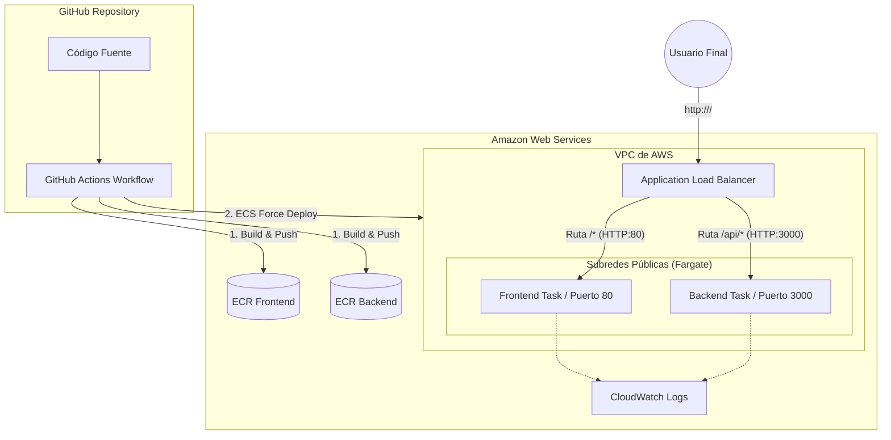

# Tienda de Perritos - Solución de Orquestación y Automatización DevOps
## Evaluación Parcial N° 3 - Introducción a Herramientas DevOps (ISY1101)

Este repositorio contiene la solución completa para el caso de estudio **Innovatech Chile**, compuesta por una arquitectura de microservicios contenedorizada con **Docker**, automatizada con **GitHub Actions**, y orquestada en **AWS ECS Fargate** a través de un **Application Load Balancer (ALB)**.

---

## 1. Arquitectura del Sistema

La solución separa el tráfico del cliente en dos microservicios independientes:

*   **Frontend (Nginx):** Entrega la interfaz web responsiva (HTML5, CSS3, JS) y expone la tienda al exterior. Está configurado para iniciar de forma segura en entornos de nube sin depender de la resolución DNS del backend en el arranque.
*   **Backend (Node.js/Express):** API REST que sirve el catálogo de productos (`GET /api/products`), procesa la simulación bancaria del checkout (`POST /api/checkout`), y provee telemetría de salud (`GET /api/health`).

### Diagrama de Flujo y Red en AWS:



---

## 2. Ejecución y Pruebas en Entorno Local

Puedes levantar toda la infraestructura y probar la aplicación localmente usando Docker Compose:

### Requisitos:
*   [Docker Desktop](https://www.docker.com/products/docker-desktop/) instalado y en ejecución.

### Instrucciones:
1.  Clona el repositorio y abre una terminal en la raíz del proyecto.
2.  Levanta el entorno con el siguiente comando:
    ```bash
    docker-compose up --build
    ```
3.  Accede desde tu navegador a:
    *   **Tienda (Frontend):** [http://localhost](http://localhost)
    *   **Healthcheck del Backend:** [http://localhost:3000/api/health](http://localhost:3000/api/health)
4.  Para apagar y limpiar los contenedores:
    ```bash
    docker-compose down
    ```

---

## 3. Configuración y Despliegue en AWS (Fargate)

Para sortear las restricciones del entorno de **AWS Academy (Learner Labs)** —el cual bloquea la creación de Namespaces de Cloud Map / Service Connect—, se implementó un esquema de enrutamiento basado en rutas directamente en el balanceador de carga.

### Paso 1: Crear los repositorios en Amazon ECR
Crea los repositorios privados para alojar las imágenes de Docker:
```bash
aws ecr create-repository --repository-name tiendaperritos-backend
aws ecr create-repository --repository-name tiendaperritos-frontend
```

### Paso 2: Crear el Clúster de ECS
Dado que la interfaz gráfica de AWS Academy puede presentar fallos de roles al crear el clúster, ejecútalo en **AWS CloudShell**:
```bash
aws ecs create-cluster --cluster-name tiendaperritos-cluster
```

### Paso 3: Crear los Target Groups (EC2)
*   **`tg-backend`:** Tipo de destino: *IP addresses*. Puerto `3000`, protocolo `HTTP`. Health Check en `/api/health`.
*   **`tg-frontend`:** Tipo de destino: *IP addresses*. Puerto `80`, protocolo `HTTP`. Health Check en `/health`.

### Paso 4: Crear y Configurar el Balanceador de Carga (ALB)
1.  Crea un **Application Load Balancer** público (`tiendaperritos-alb`).
2.  Agrega un Listener en el puerto `80` HTTP que redirija por defecto a `tg-frontend`.
3.  Ve a la gestión de reglas del Listener de puerto 80 y agrega una regla de prioridad alta:
    *   **Condición:** Path es `/api/*`
    *   **Acción:** Forward to `tg-backend`

### Paso 5: Crear las Task Definitions
Crea dos Task Definitions separadas de tipo **Fargate** (`tiendaperritos-backend` y `tiendaperritos-frontend`):
*   Usa **`LabRole`** como rol de ejecución de tarea y de tarea.
*   Usa la asignación de recursos mínima: `0.25 vCPU` y `0.5 GB` de RAM.
*   Container Backend: Puerto `3000`, protocolo `HTTP`.
*   Container Frontend: Puerto `80`, protocolo `HTTP`.

### Paso 6: Crear los Servicios en ECS
Crea los servicios `backend-service` y `frontend-service` en tu clúster:
*   IP pública: **Enabled** (obligatorio para descargar las imágenes de ECR en Learner Labs).
*   Service Connect: **Disabled**.
*   Asocia cada servicio a su Target Group correspondiente (`tg-backend` y `tg-frontend` respectivamente).

### Paso 7: Regla de Escalabilidad (Autoscaling)
Aplica una política de escalabilidad de tipo **Target Tracking** en el uso promedio de CPU al **50%** en el servicio de backend para garantizar tolerancia a picos de carga.

---

## 4. Pipeline de CI/CD (GitHub Actions)

El workflow se encuentra en [.github/workflows/deploy.yml](file:///.github/workflows/deploy.yml).

### Secrets de GitHub Requeridos:
Para habilitar el despliegue automático, configura las siguientes claves temporales en **Settings** -> **Secrets and variables** -> **Actions** en tu repositorio:
*   `AWS_ACCESS_KEY_ID`
*   `AWS_SECRET_ACCESS_KEY`
*   `AWS_SESSION_TOKEN` (Obligatorio en AWS Academy)

Cada `git push` a la rama `main` compilará las imágenes, las subirá a ECR y forzará la actualización de tareas en ECS.

---

## 5. Validación y Monitoreo

*   **Logs del Sistema:** Centralizados en Amazon CloudWatch en los grupos `/ecs/tiendaperritos-backend` y `/ecs/tiendaperritos-frontend`.
*   **Prueba de Disponibilidad:** Accede a la URL pública asignada a tu ALB (ej: `http://tiendaperritos-alb-123456789.us-east-1.elb.amazonaws.com`) para ver la aplicación web respondiendo y conectándose con la API REST.
